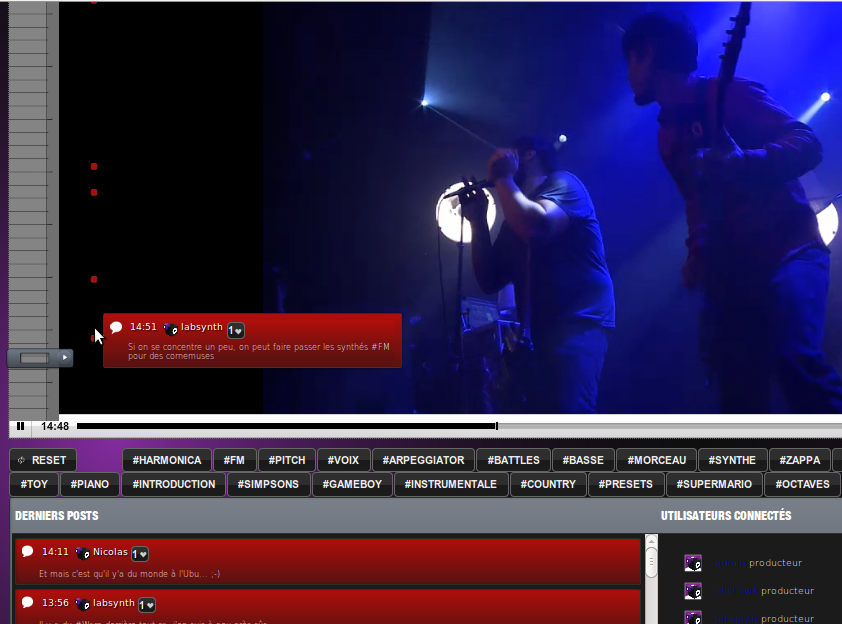
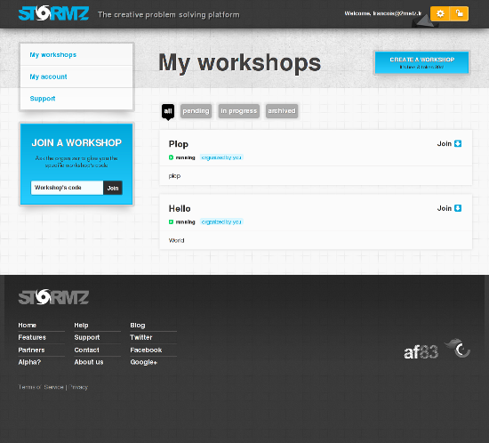

# Professional services

You'll find here a list of companies providing services around U.C.Engine.

## U.C.Engine editor

### U.C.Engine by af83

af83 is the creator and main editor of U.C.Engine.

We provide a whole set of services around U.C.Engine : consulting, prototyping, user experience design, engineering, hosting support and training.

More detail on our [[U.C.Engine by af83 website|http://ucengine.af83.com]].

## U.C.Engine application development

Companies that integrate U.C.Engine to build custom applications for their customers.

### CommOnEcoute

[[CommOnEcoute|http://commonecoute.fr/]], the concert experience in 2.0 mode. Currently in beta.

### Stormz by af83

[[Stormz|https://stormz.me/]], the creative problem solving platform.

## Distributions based on U.C.Engine

Companies that provide packaged solutions based on U.C.Engine.

## Not on the list ?

Any company providing professional services around U.C.Engine can be listed in this directory. Just make a request with all the background information on the [[U.C.Engine documentation repository|https://github.com/AF83/ucengine-docs]].
